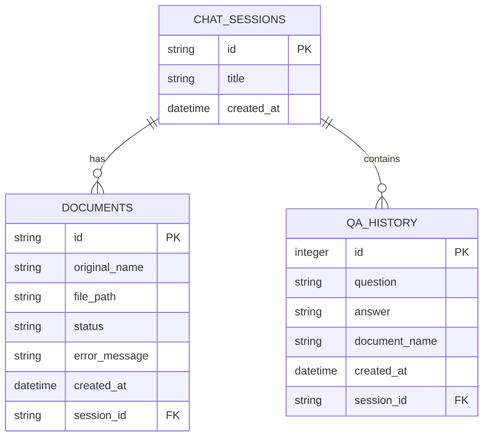

# IntelliSearch - Enterprise RAG Platform

IntelliSearch is a professional, session-aware Retrieval-Augmented Generation (RAG) platform. It allows users to manage multiple independent chat sessions, upload and process multiple PDF and TXT documents per session, and query their aggregated content in real-time.

All uploaded files, conversation history, and vectorized indexes are persisted locally, allowing seamless continuation of work across browser refreshes and server restarts.

---

## Key Features

- **Multi-Session Management**: Create, switch between, and delete chat sessions. Document contexts and Q&A history remain isolated per session.
- **Persistent Storage**: Uses a SQL-backed schema (SQLite/PostgreSQL) to store session metadata, document statuses, and full Q&A interaction histories.
- **Asynchronous Processing**: Non-blocking document ingestion. PDFs and TXTs are parsed, chunked, and vectorized in the background via FastAPI's `BackgroundTasks`.
- **Dynamic Index Merging**: Vector stores (FAISS) are generated per-document and merged in-memory on demand when a query is run, avoiding slow indexing pipelines and enabling instant document deletions.
- **Intuitive UI**: Modern dark-themed workspace with real-time status updates (polling), file drag-and-drop, and full database history view.

---

## Technical Stack

- **Backend**: FastAPI (Python), Uvicorn
- **Database**: SQLite (SQLAlchemy ORM)
- **NLP & Ingestion**: LangChain, FAISS, Hugging Face Endpoint Embeddings (`all-MiniLM-L6-v2`)
- **LLM Engine**: Groq Cloud API (customizable in `main.py`)
- **Frontend**: Vanilla HTML5, CSS3, & modern JavaScript

---

## Database Schema



---

## Installation & Setup

### 1. Prerequisites
- Python 3.10+
- A Groq API Key (Sign up at [Groq Console](https://console.groq.com/))
- A Hugging Face Access Token (Get a free token at [Hugging Face Settings](https://huggingface.co/settings/tokens))

### 2. Activate Virtual Environment
```bash
source venv/bin/activate
```

### 3. Install Dependencies
```bash
pip install -r requirements.txt
```

### 4. Configure Environment Variables
Create a `.env` file in the root directory (or export directly to your environment):
```env
GROQ_API_KEY=your_groq_api_key_here
HUGGINGFACEHUB_API_TOKEN=your_huggingface_access_token_here
DATABASE_URL=sqlite:///./rag_app.db
```

---

## Run Commands

Start the FastAPI application server using Uvicorn:

```bash
uvicorn main:app --port 8000 --reload
```

Open your browser and navigate to:
```
http://localhost:8000
```

---

## API Endpoints

| Endpoint | Method | Description |
|---|---|---|
| `/` | `GET` | Serves the main UI |
| `/api/sessions` | `POST` | Register or restore a chat session |
| `/api/sessions` | `GET` | List all active chat sessions |
| `/api/sessions/{session_id}` | `DELETE` | Delete a session and its associated files/history |
| `/api/sessions/{session_id}/documents` | `GET` | Retrieve documents associated with a session |
| `/api/upload` | `POST` | Upload and queue a document for indexing |
| `/api/documents/{doc_id}/retry` | `POST` | Retry a failed indexing task |
| `/api/documents/{doc_id}` | `DELETE` | Delete a document from the session |
| `/api/query` | `POST` | Query the aggregated document index |
| `/api/history` | `GET` | Retrieve session Q&A database logs |
| `/api/history` | `DELETE` | Clear all Q&A history for a session |
